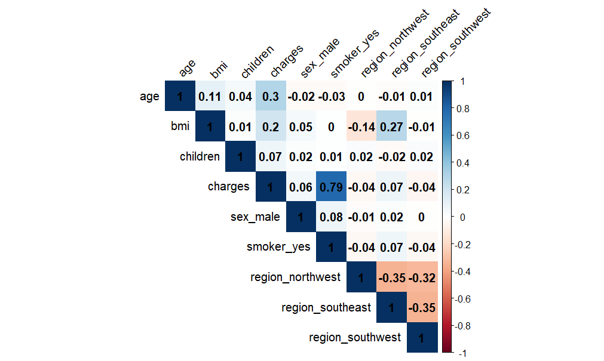
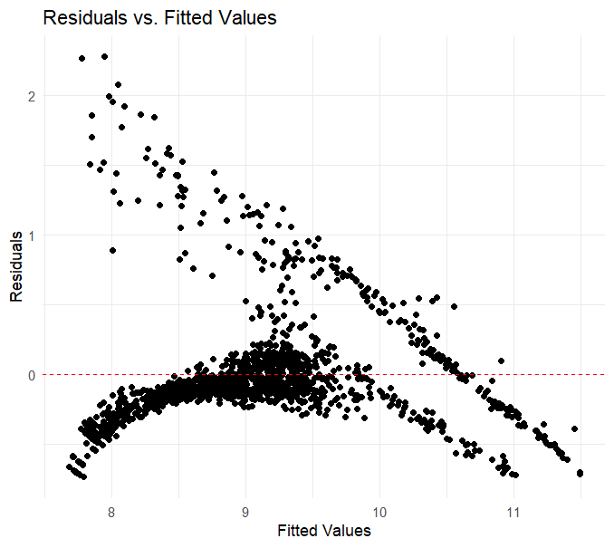
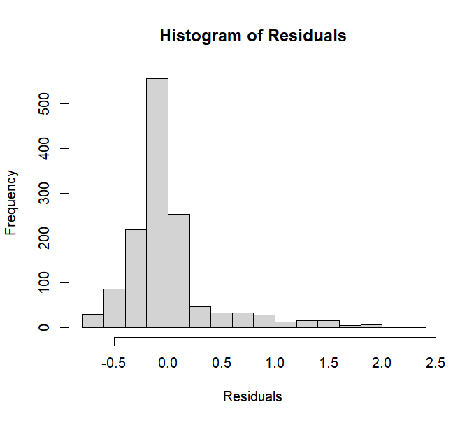
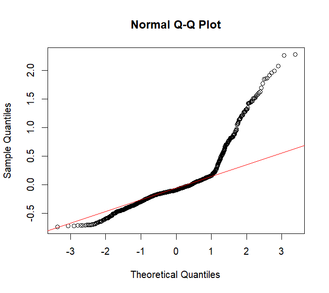

<!DOCTYPE html>
<html lang="en">
<head>
<meta charset="UTF-8">
<meta name="viewport" content="width=device-width, initial-scale=1.0">
<title>Unraveling the Determinants: A Comprehensive Analysis of Factors Influencing Health Insurance Charges in the U.S.</title>

</head>
<body>

<header class="header">

  <h1><b>
Unraveling the Determinants: A Comprehensive Analysis of Factors Influencing Health Insurance Charges in the U.S.
</b></h1>
  
<b>Sebastião Rosalino - 20230372, Andriani Kakoulli - 20230484, Guilherme Sá - 20230520, Sophia Mizinski Ramos - 20230999</b>

  

  
</header>

</head>
<body>

  

    

      <b>Introduction</b>
    

    

      In health insurance analytics, it is crucial to dissect the myriad factors influencing individual medical costs to guide decision-making and policy development. This investigation focuses on an extensive cross-sectional dataset that encapsulates a broad range of individual characteristics and insurance details within the United States.
        The dataset under scrutiny originates from "Machine Learning With R" by Brett Lantz, encompassing a demographic of adults aged 18-64 from the United States. Empirical evidence suggests that smoking significantly inflates health insurance charges, with estimated increases ranging from 30% to 50%[1]. Moreover, both high and low values of body mass index (BMI) are indicative of suboptimal health status, which invariably leads to heightened charges[2][3]. Notably, age emerges as a dominant factor, with the cost for individuals in their 50s estimated to be twice as high as for those in their 20s[4].
        The primary aim of this study is to refine the understanding of the complex determinants of healthcare costs. While certain factors display a positive correlation with healthcare expenditures, the association of other variables with the costs remains ambiguous. The research now pivots to analyzing and interpreting how gender, geographical location within the US, and the number of dependents influence health insurance expenses.
       
    

    

      <b>Research question</b>
    

    
<b>“How do the number of children, geographical region, and gender collectively influence health insurance charges in the United States?”</b>

    

      <b>Methodology</b>
    

    

    The methodology of this study involved a quantitative analysis using linear regression models to investigate the influence of demographic and health-related factors on health insurance charges in the United States.
      Two models were constructed: one including all data points and another with outliers removed. Independent variables such as age, BMI, number of children, smoking status, geographical region, and gender were examined.
      Interaction terms were included to assess the combined effects of these variables. Model adequacy was evaluated using the R-squared and Adjusted R-squared metrics, while the assumptions of linear regression were checked using residual plots and statistical tests for normality and homoskedasticity.
      This approach allowed for the assessment of both individual and interactive impacts of the predictors on insurance charges, ensuring a comprehensive understanding of the factors contributing to health insurance costs.
    

    

    <b>Results</b>
    

  

  The first assumption, linearity in parameters, was taken as true, after successive RESET tests experimentations. The second assumption, random and independent sampling, is upheld according to the dataset's metadata[5], indicating no evidence of non-randomness.
  

  

  The Pearson Correlation analysis revealed mostly weak correlations among the variables, except for the strong correlation between charges and smokers. To evaluate the effect of outliers, two linear regression models were compared: one with outliers included and another with outliers removed based on the IQR method. This allowed for a comparison in terms of model accuracy, variability, and adherence to linear regression assumptions.
  

  

  The absence of perfect collinearity was confirmed, as no correlation coefficients between independent variables reached the extremes of 1 or -1, satisfying the third assumption of no perfect collinearity.
  

  

  <figcaption>Figure 1: Pearson Correlation Matrix of variables</figcaption>

  

  The residuals' plot indicated a systematic pattern, suggesting a violation of the zero conditional mean assumption. This deviation can lead to biased estimates and may compromise the model's predictive accuracy.
  

  

  

  

  <figcaption>Figure 2: Scatter plot of Residuals</figcaption>

  

  Both the Breusch-Pagan and the White tests pointed towards heteroskedasticity, challenging the homoskedasticity assumption. This condition can increase the variance of coefficient estimates, implying the need for robust error estimation methods.
  

  

  The normality of residuals, a crucial assumption for linear regression, was assessed using both graphical and statistical tests. The histogram and Q-Q plot suggested deviations from normality, with the histogram showing a right skew and the Q-Q plot revealing heavier tails than expected for a normal distribution.
  

  
  <figcaption>Figure 3: Histogram of residuals</figcaption>
  
  <figcaption>Figure 4: Normal QQ-Plot of residuals</figcaption>

  

  Supporting the graphical findings, the Shapiro-Wilk and Kolmogorov-Smirnov tests both rejected the null hypothesis of normally distributed residuals, with significant p-values indicating substantial deviations from normality in the model's residuals. Due to the large sample size of 1,338 observations, the Central Limit Theorem assures that the estimators' distribution approaches normality. This enables for the use of standard statistical tests like T-tests and F-tests and build confidence intervals for reliable statistical inference.
  

  

  

   

    <b>Conclusion</b> 
    

  

    The analysis has yielded significant insights into the factors affecting health insurance charges in the US:
  

  <ul>
  <li><strong>
Age and Insurance Charges</strong>: There is an increasing trend in insurance charges with age, but the rate of increase diminishes over time. (Age coefficient: 0.05376, Age squared coefficient: -0.0002379)</li>

  <li><strong>
Body Mass Index (BMI)</strong>: A positive, yet non-linear, relationship exists between BMI and insurance charges, indicating higher costs for individuals with higher BMI. (Log(BMI) coefficient: 0.1352)</li>

  <li><strong>
Number of Children</strong>: Insurance charges escalate with the addition of each child, highlighting the financial implications of family size. (Coefficient: 0.1204)</li>

  <li><strong>
Smoking Status</strong>: Smokers face substantially higher insurance charges, with the model showing a significant impact of smoking on charges. (Smoker_yes coefficient: 2.707)</li>

  <li><strong>
Geographical Location</strong>: Insurance charges vary by region, indicating different insurance cost patterns across the US. (Coefficients: Northwest: -0.07797, Southwest: -0.1844, Southeast: -0.1883 compared to Northeast)</li>

  <li><strong>
Gender</strong>: Gender differences are evident, with males typically paying less than females, other factors being constant. (Male coefficient: -0.1055)</li>

  <li><strong>
Interactions with Smoking:
</strong>
    <ul>
      <li><strong>
BMI and Smoking</strong>: The effect of BMI on insurance charges is more pronounced for smokers. (Coefficient for interaction: 1.255)</li>

      <li><strong>
Children and Smoking</strong>: The financial impact of having children on insurance costs varies for smokers. (Coefficient for interaction: -0.1457)</li>

    </ul>
  </li>
</ul>

To sum up, the study demonstrates that the number of children, geographical region, and gender significantly influence health insurance charges in the US, with smoking status emerging as a particularly strong factor. The consistency of these patterns, despite the presence of outliers, confirms the robustness and reliability of the findings.

<h3><strong>
Key Conclusions
</strong></h3>
<ul>
  <li>
Smoking status is a crucial predictor of insurance charges.</li>

  <li>
The influence of age on insurance charges decreases over time.</li>

  <li>
Family size and regional differences play significant roles in determining insurance costs.</li>

</ul>

  <b>Recommendations</b>

The findings of the study offer vital insights for both policy-making and insurance industry practices. From this study the main recommendations/contributions are the following:

<ul>
  <li><strong>
Revision of Insurance Pricing Structures:</strong> Insurance providers should consider the implications of factors like age, BMI, and particularly smoking status on insurance charges. The influence of factors such as the number of children and geographical region could also be reevaluated in pricing models.</li>

  <li><strong>
Targeted Health Interventions:</strong> Focused health interventions for high-cost demographic groups, especially smokers, could be an effective strategy to manage and potentially reduce insurance expenses.</li>

</ul>

  Additionally, this study underscores important considerations in health equity:

<ul>
  <li><strong>
Gender-Sensitive Insurance Pricing:</strong> Given the observed gender differences in insurance charges, a review of insurance pricing to ensure fairness and equity is recommended.</li>

</ul>

  For future research directions:

<ul>
  <li><strong>
Causality and Longitudinal Analysis:</strong> Investigating the causal relationships between the factors studied, such as smoking, BMI, and age, and insurance charges is crucial. Longitudinal studies could offer deeper insights, especially in accounting for time-variant factors.</li>

  <li><strong>
Exploring Lifestyle and Genetic Factors:</strong> A deeper exploration into the role of lifestyle choices and genetic predispositions on insurance charges could provide a more nuanced understanding of risk factors.</li>

</ul>

These recommendations aim to contribute meaningfully to the ongoing discourse in healthcare policy and insurance practices, promoting a more equitable and informed approach to insurance charge determination.

    

    <b>References</b>
    

    
[1] https://www.gocompare.com/health-insurance/smoking-and-vaping/

    
[2] https://www.sbilife.co.in/en/knowledge-centre/insurance-basics-financial-advice/bmi-life-insurance-premium

    
[3] https://www.ncbi.nlm.nih.gov/pmc/articles/PMC7337412/

    
[4] https://www.valuepenguin.com/how-age-affects-health-insurance-costs#:~:text=Health%20insurance%20rates%20get%20higher,did%20in%20your%20early%2020s.

    
[5] https://www.kaggle.com/datasets/mirichoi0218/insurance

  

  

</body>
</html>
